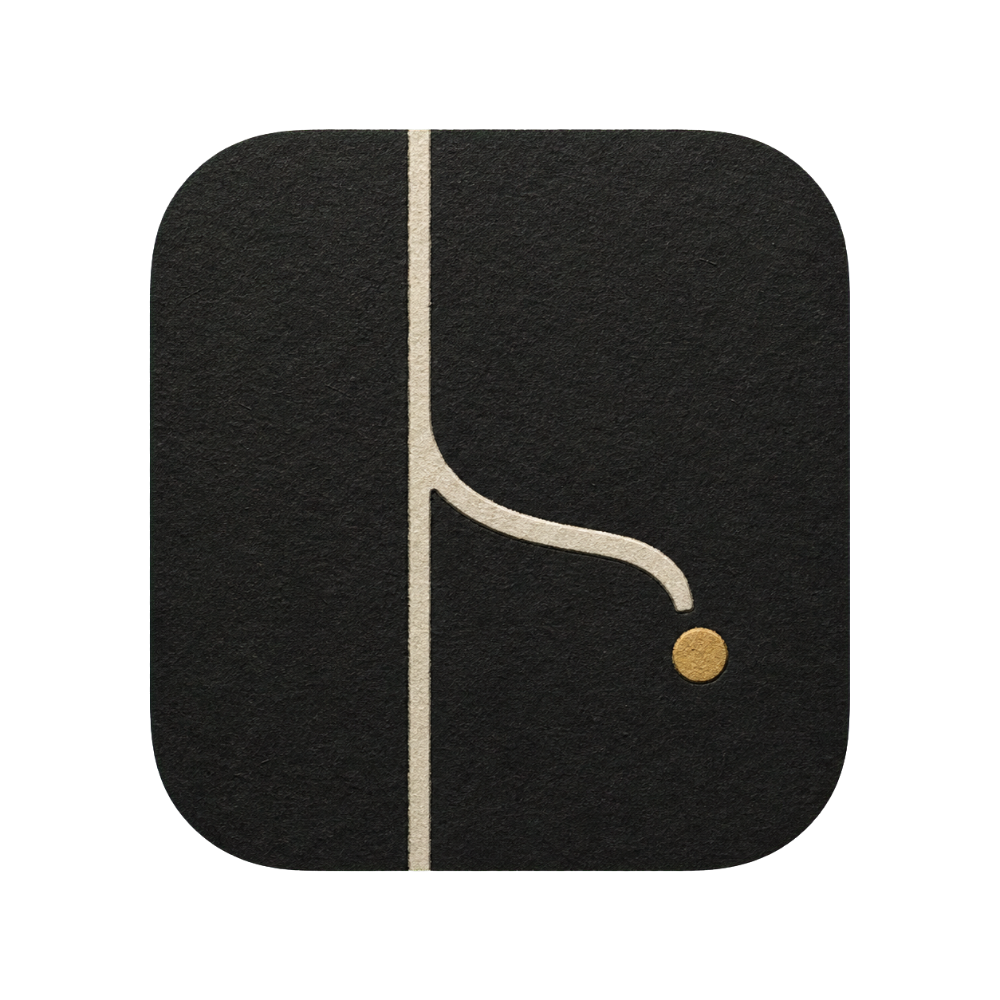

# Sidetrack



Sidetrack is a quiet second-screen focus display for macOS. One sentence holds the center. Everything else waits in the margin.

No account. No sync. No notifications. No streaks. No network calls. No Chromium.

## Why

Some brains do not need another productivity system. They need somewhere gentle to return to.

Sidetrack keeps one thought large, a few subthoughts nearby, and the rest of today small. Its pomodoro refuses false precision: `~20 minutes left`, then `a few minutes left`. Clock time speaks in quarters. Nothing rings unless you explicitly ask for one soft chime. Nothing starts a break without you.

Read [PHILOSOPHY.md](PHILOSOPHY.md) for the thinking behind it.

## What it does

- Opens full-screen on the last-used display.
- Adapts cleanly down to a 900 × 600 window: the main sentence reflows and scales, while low-priority subthoughts step out before the page becomes crowded.
- Holds one editable main thought plus one level of subthoughts.
- Lets later thoughts and their subthoughts gather upward from the bottom margin.
- Runs a manual `50 / 12 / 50 / 12 / 50 / 30` focus rhythm.
- Fades secondary material during focus.
- Uses stable, literal timer states—Ready, Focus, Focus paused, Short break, Long break—and always says what a click will do.
- Speaks the date and time through changing light: dawn, twilight, moonlight, and the hours between.
- Displays its clock 15 minutes ahead by default; the offset is editable in Preferences and never changes pomodoro timing.
- Counts distractions with a tiny daily `0000` clicker; hover reveals a soft decrement and the keyboard map, while right-click shows seven days.
- Saves the finished day automatically as readable Markdown after midnight or on the next launch; manual export remains available.
- Cycles through a small bank of human placeholders when you begin fresh.
- Saves everything locally as readable JSON.

## Keys

- `N` — add a new thought
- `S` — add a subthought to the main thought
- `E` — write over the main thought
- `T` or `Space` — start, pause, or resume the timer
- `P` — promote the next thought
- `K` — check the next main-task step
- `C` — complete the main thought
- `D` — count one distraction
- `U` — undo one distraction count
- `R` — archive and reset the day
- `Y` — reset the rhythm only
- `M` — export the day as Markdown
- `A` — reveal automatically saved days
- `O` or `,` — preferences
- `F` or `⌃⌘F` — enter or leave full screen
- `⌘Z` — undo checking, promotion, deletion, or reset

When focus finishes, `B` begins the break and `K` keeps working. When a break finishes, `S` starts focus and `N` waits.

Click circles to check items. Click a later thought to promote it. Right-click thoughts, subthoughts, or open space for the actions that belong there.

## Privacy and files

Sidetrack never uses the network. Runtime data lives at:

```text
~/Library/Application Support/Sidetrack/sidetrack.json
```

The file is pretty-printed JSON. Sidetrack keeps the prior good write beside it as `sidetrack.previous.json`; unreadable data is preserved as `sidetrack.unreadable.json` instead of being silently discarded.

At day change, Sidetrack writes the previous day to:

```text
~/Library/Application Support/Sidetrack/Days/YYYY-MM-DD.md
```

Starting fresh twice never overwrites the first page; later copies receive `-2`, `-3`, and so on.

Press `A` to reveal that folder. Manual export uses a normal macOS save panel and creates a plain `.md` file wherever you choose.

## Build

Requires macOS 13 or newer and Apple Command Line Tools.

```sh
Scripts/test.sh
Scripts/build-app.sh
```

Built app appears at `build/Sidetrack.app`. Build uses `swiftc` directly so no full Xcode install is required.

## Performance

Sidetrack is native AppKit with custom event-driven drawing. No continuous render loop exists. Clock, vague timer, and pixel drift redraw once per minute; edits and window changes redraw on input. An idle minute does not touch the data file.

Measured in full-screen on a 1920 × 1080 logical second display after the current polish pass:

- `0.0%` CPU between minute updates; one brief redraw on the minute, then the process sleeps again
- roughly `7–11 MB` resident memory after settling
- `478 KB` executable; `3.1 MB` installed app bundle including font and icon

The compact layout survived 40 rapid resizes across 900 × 600, 1000 × 700, 1200 × 760, 1440 × 900, and 1920 × 1049. A separate burst of 202 timer and counter actions completed in under one second without a lost write or damaged backup.

## Freedom

Sidetrack source and original artwork are dedicated to the public domain under [CC0 1.0 Universal](LICENSE): copy it, fork it, sell it, remake it, or remove every decision made here.

Bundled Newsreader typeface remains under the SIL Open Font License 1.1. See [THIRD_PARTY_NOTICES.md](THIRD_PARTY_NOTICES.md).
