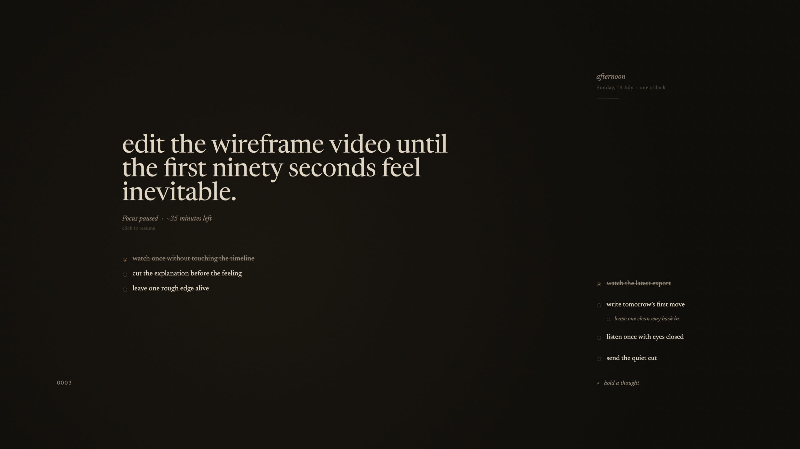

# Sidetrack



Sidetrack is a quiet second-screen focus display for macOS. One sentence holds the center. Everything else waits in the margin.

No account. No sync. No notifications. No streaks. No network calls. No Chromium.

[Download the latest macOS app](https://github.com/bomkino/sidetrack/releases/latest) · macOS 13 or newer · Apple silicon and Intel

## Why

Some brains do not need another productivity system. They need somewhere gentle to return to.

Sidetrack keeps one thought large, a few subthoughts nearby, and the rest of today small. Its pomodoro refuses false precision: `~20 minutes left`, then `a few minutes left`. Clock time speaks in quarters. Nothing rings unless you explicitly ask for one soft chime. Nothing starts a break without you.

Read [PHILOSOPHY.md](PHILOSOPHY.md) for the thinking behind it.

## What it does

- Opens full-screen on the chosen second display: left, right, above, or the last remembered screen.
- Lets the app live in the Dock, the menu bar, or both. Menu-bar-only mode keeps the page one click away without adding another Cmd-Tab stop.
- Uses a small editorial grid in portrait and landscape. The default vertical page gives Today and the distraction counter the top register, then anchors the focus sentence and rhythm lower down; the alternate main-first split remains available. The Today panel can live on either side, with balanced-edge, left-edge, right-edge, and swapped-order presets.
- Preferences preview live as you change them; there is no save-and-guess loop.
- Gives each quiet layer its own bounded size control—main thought, rhythm, Today list, steps, date/time, and distraction count.
- Offers OLED dim mode: when focus is running, the background becomes true black and the thought, rhythm, and time remain awake while everything else recedes.
- Adapts cleanly down to a 900 × 600 window: the main sentence reflows and scales, while low-priority subthoughts step out before the page becomes crowded.
- Holds one editable main thought plus one level of subthoughts.
- Lets later thoughts and their subthoughts gather upward from the bottom margin.
- Runs a manual `50 / 12 / 50 / 12 / 50 / 30` focus rhythm.
- Fades secondary material during focus.
- Uses stable, literal timer states—Ready, Focus underway, Focus paused, Short rest underway, Long rest underway—and always says what a click will do.
- If a finished focus or rest waits for you, it whispers rather than notifying: one slow text breath at 2× the phase length, a glyph-aware hairline at 3× that leaves room for descenders, both at 4×, then silence at 5× for a likely away-from-keyboard stretch.
- Speaks the date and time through changing light: dawn, twilight, moonlight, and the hours between.
- Displays its clock 15 minutes ahead by default; the offset is editable in Preferences and never changes pomodoro timing.
- Counts distractions with a tiny daily `0000` clicker; hover reveals a soft decrement and the keyboard map, while right-click shows seven days.
- Keeps a short, persistent north star beside the clicker—20 characters, carried from day to day. Click it or press `G` to rewrite it.
- Saves the finished day automatically as readable Markdown after midnight or on the next launch; manual export remains available.
- Cycles through a small bank of human placeholders when you begin fresh.
- Begins with an empty page rather than pretending a demo task belongs to you.
- Saves everything locally as readable JSON.

## Keys

- `N` — add a new thought
- `S` — add a subthought to the main thought
- `E` — write over the main thought
- `G` — write the small north star beside the distraction count
- `T` or `Space` — start, pause, or resume the timer
- `P` — promote the next thought
- `K` — check the next main-task step
- `C` — complete the main thought
- `D` — count one distraction
- `U` — undo one distraction count
- `R` — archive and reset the day
- `Y` — reset the rhythm only
- `M` — export the day as Markdown
- `A` — reveal automatically saved days
- `O` or `,` — preferences
- `F` or `⌃⌘F` — enter or leave full screen
- `⌘Z` — undo checking, promotion, deletion, or reset

When focus finishes, `B` begins the break and `K` keeps working. When a break finishes, `S` starts focus and `N` waits.

Click circles to check items. Click a later thought to promote it. Right-click thoughts, subthoughts, or open space for the actions that belong there.

## Privacy and files

Sidetrack never uses the network. Runtime data lives at:

```text
~/Library/Application Support/Sidetrack/sidetrack.json
```

The file is pretty-printed JSON. Sidetrack keeps the prior good write beside it as `sidetrack.previous.json`; if the primary file disappears or becomes unreadable, the backup restores it. Unreadable source data is preserved as `sidetrack.unreadable.json` instead of being silently discarded.

At day change, Sidetrack writes the previous day to:

```text
~/Library/Application Support/Sidetrack/Days/YYYY-MM-DD.md
```

Starting fresh twice never overwrites the first page; later copies receive `-2`, `-3`, and so on.

Press `A` to reveal that folder. Manual export uses a normal macOS save panel and creates a plain `.md` file wherever you choose.

## Build

Requires macOS 13 or newer and Apple Command Line Tools.

```sh
Scripts/test.sh
Scripts/build-app.sh
```

The unpacked app appears at `build/Sidetrack.app`; a clean signed install archive appears beside it as `build/Sidetrack.app.zip`. Build uses `swiftc` directly so no full Xcode install is required.

Small, careful contributions are welcome. Read [CONTRIBUTING.md](CONTRIBUTING.md) before changing Sidetrack’s interaction or visual language.

## Performance

Sidetrack is native AppKit with custom event-driven drawing. No continuous render loop exists. Clock, vague timer, and pixel drift redraw once per minute; edits and window changes redraw on input. An idle minute does not touch the data file.

The overrun whisper performs one finite Core Animation breath when each late threshold arrives, then the display cycle sleeps again. It never becomes a second-by-second countdown or a permanent animation loop.

Measured in full-screen on a 1920 × 1080 logical second display after the current polish pass:

- `0.0%` CPU between minute updates; one brief redraw on the minute, then the process sleeps again
- roughly `44–55 MB` resident memory in the final windowed resize pass; on a 2160 × 3840 physical portrait display, macOS may retain about `90 MB` of physical footprint for the native full-screen backing surface, stable while idle rather than a growing allocation
- `566 KB` executable; `3.2 MB` installed app bundle including font and icon

The compact layout survived 40 rapid resizes across 900 × 600, 1000 × 700, 1200 × 760, 1440 × 900, and 1920 × 1049. A separate burst of 202 timer and counter actions completed in under one second without a lost write or damaged backup.

## Freedom

Sidetrack source and original artwork are dedicated to the public domain under [CC0 1.0 Universal](LICENSE): copy it, fork it, sell it, remake it, or remove every decision made here.

Bundled Newsreader typeface remains under the SIL Open Font License 1.1. See [THIRD_PARTY_NOTICES.md](THIRD_PARTY_NOTICES.md).
